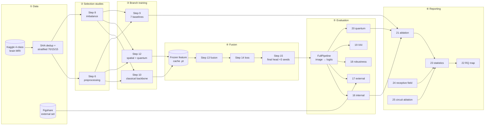
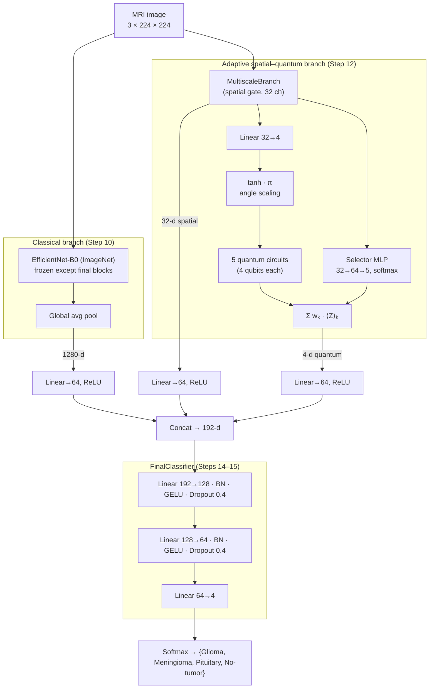
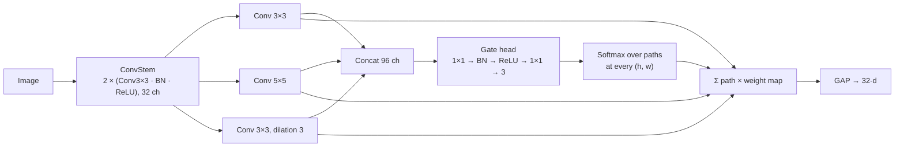
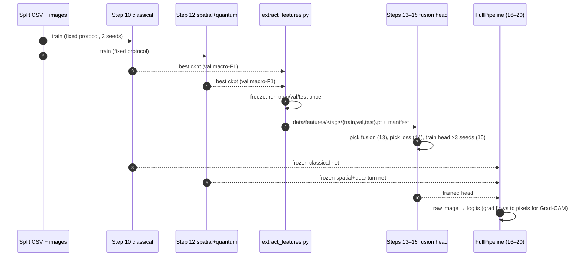
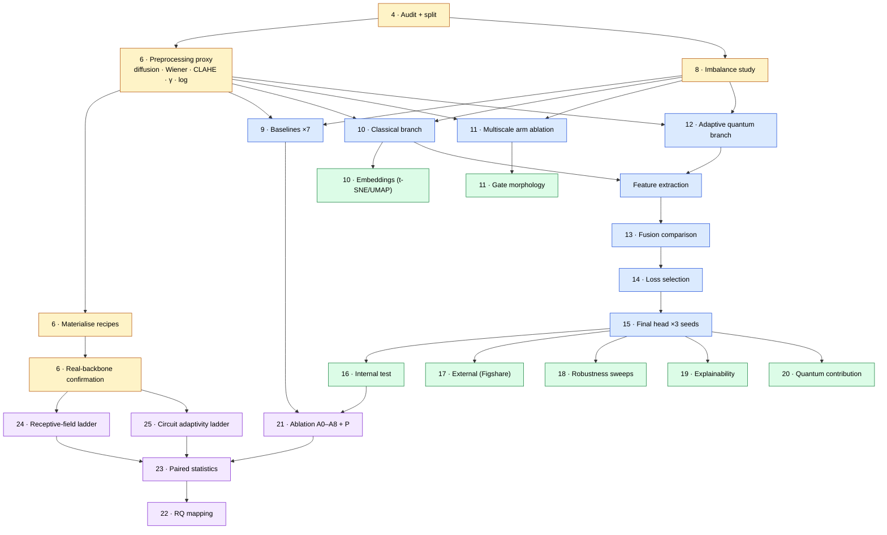
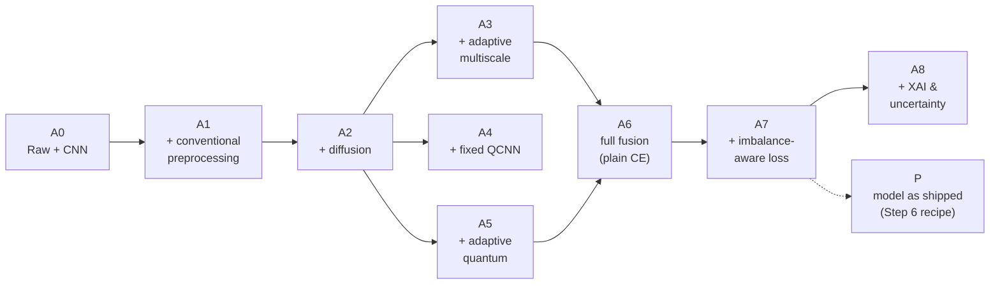
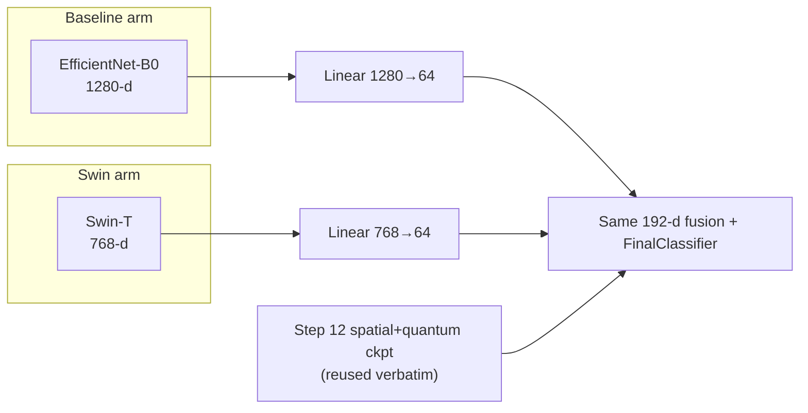
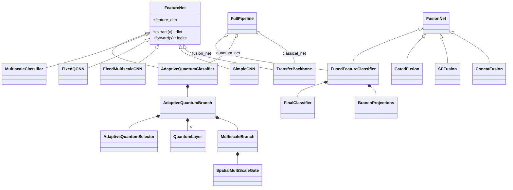

# Brain Tumour MRI Classification with Adaptive Multiscale and Quantum Feature Fusion

A Hydra + PyTorch Lightning research framework for **four-class brain MRI classification**. It
fuses three feature sources: a pretrained classical backbone, a spatially adaptive multiscale
CNN, and a learned mixture of simulated quantum circuits. Around the model sits a 25-step
experimental protocol covering the data audit, preprocessing, imbalance, baselines, fusion,
evaluation, explainability, ablation and statistics.

| Label | Class      |
|:-----:|------------|
| 0     | Glioma     |
| 1     | Meningioma |
| 2     | Pituitary  |
| 3     | No-tumor   |

> **Status.** All stages are implemented and have passed smoke runs. Full-protocol results are
> not reported in this repository, and the Swin-T arm has not yet been executed at scale. See
> [Limitations](#10-limitations).

---

## Contents

1. [Research questions](#1-research-questions)
2. [System overview](#2-system-overview)
3. [Model architecture](#3-model-architecture)
4. [Training strategy](#4-training-strategy)
5. [Experimental protocol (Steps 4–25)](#5-experimental-protocol-steps-425)
6. [Ablation design](#6-ablation-design)
7. [Backbone arms: EfficientNet-B0 vs Swin-T](#7-backbone-arms-efficientnet-b0-vs-swin-t)
8. [Repository structure](#8-repository-structure)
9. [Quick start](#9-quick-start)
10. [Limitations](#10-limitations)
11. [Documentation](#11-documentation)

---

## 1. Research questions

Each research question maps to the experiment that provides its evidence (Step 22, `configs/analysis/step22_rq_mapping.yaml`).

| RQ | Question | Evidence from |
|----|----------|---------------|
| RQ1 | Does the proposed model improve multiclass classification? | Steps 9, 15, 16 |
| RQ2 | Does diffusion preprocessing help? | Steps 6, 21 (A1→A2) |
| RQ3 | Are boundary and texture details preserved? | Steps 6, 11, 19 |
| RQ4 | Do adaptive kernels and circuits outperform fixed ones? | Steps 11, 12, 24, 25 |
| RQ5 | Does the model handle tumour variation? | Steps 11, 16, 18 |
| RQ6 | Which imbalance strategy works best? | Steps 8, 14 |
| RQ7 | How does it perform on an external dataset? | Step 17 |
| RQ8 | Is there a measurable quantum benefit? | Steps 20, 25 |
| RQ9 | Are the predictions explainable? | Step 19 |
| RQ10 | How much does each component contribute? | Steps 21, 23 |

The study does not assume quantum superiority, and a negative result counts as a valid outcome.

---

## 2. System overview



Hydra composes every stage from `configs/`. The orchestrator `scripts/kaggle_pipeline.py` runs
them in dependency order, resumes where a previous run stopped, and writes completion markers
plus a `REPORT.md`.

---

## 3. Model architecture

### 3.1 The proposed model



| Component | Code | Output |
|---|---|---:|
| Classical branch | `TransferBackbone` in `src/models/components/transfer.py` | 1280 (EffNet-B0) / 768 (Swin-T) |
| Spatial branch | `MultiscaleBranch` in `src/models/components/multiscale.py` | 32 |
| Quantum branch | `AdaptiveQuantumBranch` in `src/models/components/quantum.py` | 4 |
| Projections + head | `FusedFeatureClassifier` in `src/models/components/fusion.py` | 192 → 4 |
| End-to-end wrapper | `FullPipeline` in `src/models/full_pipeline.py` | logits |

### 3.2 Spatially adaptive multiscale gate

Three parallel receptive fields are mixed by a **per-pixel** softmax, so every location picks
its own kernel scale.



Step 11 and Step 24 compare this gate against a fixed single scale, a fixed multiscale
concatenation, and a global (per-image) gate.

### 3.3 Adaptive mixture of quantum circuits

Each image runs through all five circuits. A learned selector then **softly weights** their
PauliZ expectation values, so no circuit is skipped and none is picked alone.

| Circuit | Encoding | Ansatz | Depth |
|---|---|---|---:|
| `fixed` | AngleEmbedding | BasicEntanglerLayers | 2 |
| `deep` | AngleEmbedding | BasicEntanglerLayers | 4 |
| `strong` | AngleEmbedding | StronglyEntanglingLayers | 2 |
| `combined` | AngleEmbedding | StronglyEntanglingLayers | 4 |
| `reupload` | AngleEmbedding before **each** layer | BasicEntanglerLayers | 2 |

The circuits are simulated with PennyLane `default.qubit` on the CPU, wrapped as `qml.qnn.TorchLayer`.
Nothing runs on quantum hardware.

### 3.4 Fusion variants (Step 13)

| Strategy | Mechanism |
|---|---|
| `ConcatFusion` | Project each branch to 64-d, concatenate, MLP head |
| `SEFusion` | Squeeze-and-excitation reweighting of the concatenated 192-d vector |
| `GatedFusion` | Softmax weight **per branch per image** |
| `FusedFeatureClassifier` | Concat + deeper BN/GELU head. This is the shipped final model. |

### 3.5 Baselines (Step 9)

Simple CNN · ResNet-50 · EfficientNet-B0 · ViT-B/16 · Swin-T · fixed multiscale CNN · fixed
QCNN. All seven are trained under the same fixed protocol.

---

## 4. Training strategy

The simulated quantum branch runs roughly five times slower than a single circuit, because every
image passes through five circuits. The model is therefore trained in **stages**: each
branch is trained once, frozen, and its features are cached. The fusion head then trains on the
cached tensors in seconds.



### Fixed protocol (`configs/protocol/fixed.yaml`)

| Setting | Value |
|---|---|
| Optimizer | AdamW, lr `1e-4`, weight decay `1e-4` |
| Scheduler | Cosine annealing |
| Batch size / max epochs | 32 / 30 |
| Early stopping | patience 12 on `val/f1_macro` |
| Checkpoint selection | best validation macro-F1 |
| Seeds | 42, 123, 7 |
| Input | 224 × 224, ImageNet normalisation |

### Loss options (Steps 8 and 14)

`plain_ce` · `weighted_ce` (inverse-frequency class weights) · `focal`. They can be combined with
a weighted sampler and augmentation.

---

## 5. Experimental protocol (Steps 4–25)



| Step | Entry point | What it produces |
|---|---|---|
| 4 | `analyze.py analysis=step04_audit` | Image stats, corruption check, `data/splits/dataset_split.csv` |
| 6 | `analyze.py analysis=step06_preprocessing` / `step06_confirm` | Ranked preprocessing recipes, then confirmed on a real backbone |
| 8 | `analyze.py analysis=step08_imbalance` | Class weights vs focal vs sampler vs augmentation |
| 9–12 | `train.py experiment=step09…step12` | Baseline and branch checkpoints |
| 13–15 | `analyze.py` + `train.py experiment=step15_final_protocol` | Fusion choice, loss choice, final head |
| 16 | `analysis=step16_internal` | Macro-F1, per-class recall, ECE, confusion matrix. Writes a test lock. |
| 17 | `analysis=step17_external` | Figshare (3 tumour classes) transfer |
| 18 | `analysis=step18_robustness` | Noise, blur, contrast, intensity and resolution degradation sweeps |
| 19 | `analysis=step19_explainability` | Grad-CAM, attribution, MC-dropout, sanity checks |
| 20 | `analysis=step20_quantum_advantage` | Quantum features zeroed (McNemar, paired bootstrap), fixed vs adaptive circuits, efficiency, separability |
| 21 | `analysis=step21_ablation` | A0–A8 + P table |
| 22 | `analysis=step22_rq_mapping` | Evidence table for RQ1–RQ10 |
| 23 | `analysis=step23_statistics` | Paired tests and confidence intervals across seeds |
| 24 | `analysis=step24_receptive_field` | Controlled receptive-field comparison (5 conditions) |
| 25 | `analysis=step25_quantum_circuit_ablation` | Single fixed circuit vs adaptive mixture (4 conditions) |

---

## 6. Ablation design

The Step 21 rows are defined **as data** in `src/analysis/ablation_rows.py`, so tests can assert
that neighbouring rows differ in exactly one factor.



- **A6 uses plain CE**, so that A6 → A7 measures the loss and nothing else.
- **Row P** records the model that was actually trained on the Step 6 selected recipe. Rows
  A2–A6 keep diffusion as the specification requires.
- Step 24 (receptive field) and Step 25 (circuit adaptivity) are separate controlled
  comparisons. Each of their conditions changes only one config key.

---

## 7. Backbone arms: EfficientNet-B0 vs Swin-T

Swin-T was chosen on the Step 9 **validation** results: macro-F1 99.07 ± 0.10, against
98.71 ± 0.22 for EfficientNet-B0. This branch adds a Swin-T arm that swaps **only** the classical
backbone.



| Resource | Baseline | Swin arm |
|---|---|---|
| Classical config | `model/branch_classical.yaml` | `model/branch_classical_swin.yaml` |
| Feature cache | `data/features/default/` | `data/features/swin/` |
| Step 10 runs | `logs/train/runs/step10_classical/` | `logs/train/runs/step10_classical_swin/` |
| Analyses | `analysis=stepNN_*` | `analysis=stepNN_*_swin` |

The dataset, split, input size (224), protocol and seeds are identical in both arms. The full
run order is in [`docs/SWIN_EXPERIMENT.md`](docs/SWIN_EXPERIMENT.md).

---

## 8. Repository structure

```text
.
├── configs/                      # Hydra configuration (single source of truth)
│   ├── analysis/                 # One file per analysis step (+ *_swin variants)
│   ├── experiment/               # Training compositions per step
│   ├── model/                    # Baselines, branches, fusion heads
│   ├── data/                     # bt_mri, feature cache, proxy, figshare
│   ├── loss/                     # plain_ce, weighted_ce, focal
│   ├── protocol/fixed.yaml       # Shared training protocol
│   ├── trainer/ callbacks/ logger/ paths/ hydra/ debug/
│   └── train.yaml eval.yaml analyze.yaml extract_features*.yaml prepare_dataset.yaml
├── src/
│   ├── train.py                  # Lightning training entry point
│   ├── eval.py                   # Checkpoint evaluation
│   ├── analyze.py                # Dispatches analysis=<step>
│   ├── extract_features.py       # Frozen branches → cached tensors
│   ├── prepare_dataset.py        # Materialise a preprocessing recipe
│   ├── data/
│   │   ├── bt_mri_datamodule.py          # Image datamodule
│   │   ├── bt_mri_feature_datamodule.py  # Cached-feature datamodule
│   │   ├── eval_datamodules.py           # External + degraded eval sets
│   │   └── components/                   # split_builder, preprocessing, transforms,
│   │                                     # sampling, cropping, degradations, external
│   ├── models/
│   │   ├── mri_classification_module.py  # LightningModule for image models
│   │   ├── feature_fusion_module.py      # LightningModule for fusion heads
│   │   ├── full_pipeline.py              # Frozen branches + head, image → logits
│   │   └── components/                   # transfer, backbones, multiscale, quantum,
│   │                                     # fusion, losses, explain
│   ├── analysis/                 # One module per study step + shared metric battery
│   └── utils/                    # metrics, statistics, checkpoints, atomic I/O, logging
├── scripts/
│   ├── kaggle_pipeline.py        # Resumable stage orchestrator (smoke / fast / full)
│   ├── make_kaggle_notebook.py
│   └── download_data.{sh,ps1}
├── notebooks/                    # Kaggle runner + historical research notebook
├── tests/                        # pytest suite (splits, models, configs, pipeline, stats)
├── docs/                         # Specification, implementation plan, deviations, Swin guide
├── USAGE.md                      # Detailed command reference
└── requirements.txt / environment.yaml / pyproject.toml / Makefile
```

### Code-level class map



---

## 9. Quick start

```bash
# 1. Environment
python -m pip install -r requirements.txt shap

# 2. Data (Kaggle credentials required; see .env.example)
bash scripts/download_data.sh --external        # Windows: .\scripts\download_data.ps1 -IncludeExternal

# 3. Audit + split
python src/analyze.py analysis=step04_audit

# 4a. Run the whole study through the orchestrator
python scripts/kaggle_pipeline.py --list --profile full   # inspect the stage graph
python scripts/kaggle_pipeline.py --profile smoke         # execution check
python scripts/kaggle_pipeline.py --profile full          # full protocol

# 4b. Or run individual stages
python src/train.py experiment=step10_classical seed=42 trainer=gpu logger=csv test=false
python src/train.py experiment=step12_adaptive_quantum seed=42 logger=csv test=false
python scripts/kaggle_pipeline.py --profile full --only features
python src/analyze.py analysis=step13_fusion analysis.tag=default

# 5. Tests
python -m pytest tests/ -m "not slow" -q
```

| Profile | Behaviour |
|---|---|
| `smoke` | 1 epoch, limited batches. Checks that everything runs. |
| `fast` | Shortened training, one seed |
| `full` | Fixed protocol, seeds 42 / 123 / 7 |

[`USAGE.md`](USAGE.md) is the full command reference.

---

## 10. Limitations

- **Image-level split.** Deduplication removes exact duplicates only, so the split is not
  grouped by patient.
- **The preprocessing proxy ranks, it does not decide.** Step 6 must be confirmed on a real
  backbone before a recipe is treated as selected.
- **The final classifier uses concatenation.** If gated or SE fusion wins Step 13, it does not
  automatically replace the head.
- **Final-head seeds share cached branch features.** They are not independent full retrains.
- **The test split is not globally sealed.** `train.yaml` defaults to `test: True`, so pass
  `test=false` during development.
- **The quantum circuits are simulated** on CPU. Cached-feature timings leave out the
  simulator's inference cost.
- **Dependencies are not fully pinned.** `environment.yaml` and `setup.py` still contain template content.

[`docs/DEVIATIONS.md`](docs/DEVIATIONS.md) records every decision that departs from the
specification.

---

## 11. Documentation

| Document | Purpose |
|---|---|
| [`docs/Instruction BY asif vai.md`](docs/Instruction%20BY%20asif%20vai.md) | Research specification |
| [`docs/IMPLEMENTATION_PLAN.md`](docs/IMPLEMENTATION_PLAN.md) | Phase-by-phase implementation plan |
| [`docs/DEVIATIONS.md`](docs/DEVIATIONS.md) | Decision and deviation register |
| [`docs/SWIN_EXPERIMENT.md`](docs/SWIN_EXPERIMENT.md) | Swin-T arm execution guide |
| [`USAGE.md`](USAGE.md) | Full command reference |
| [`docs/WORKLOG.md`](docs/WORKLOG.md) | Running log of all changes |

**Stack:** PyTorch · torchvision · Lightning · TorchMetrics · Hydra · PennyLane · scikit-learn ·
SciPy · OpenCV · scikit-image · SHAP · Matplotlib · pytest
