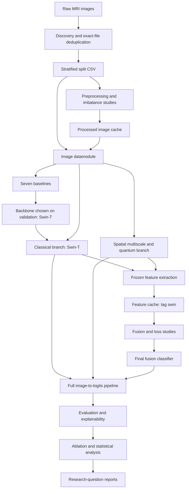
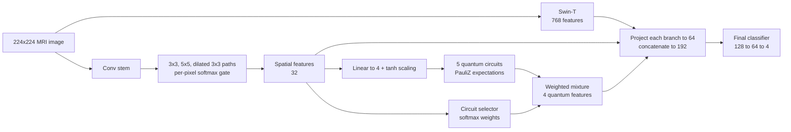

# Brain MRI Classification with Multiscale and Quantum Feature Fusion


A configurable research pipeline for four-class brain MRI classification. It combines a pretrained classical backbone, spatially adaptive multiscale convolutions, simulated quantum circuits, and feature fusion.

> **Branch: `swin-backbone`.** On this branch, the final model's classical branch is **Swin-T** (768 features). The original **EfficientNet-B0** arm (1280 features) is still here, unchanged and runnable, as the comparison arm. Swin-T was chosen because it had the best validation macro-F1 of the seven Step 9 baselines. See [The Two Backbone Arms](#the-two-backbone-arms).

The repository covers dataset preparation, model training, controlled comparisons, evaluation, explainability, and statistical reporting. These are organized around the experiments in the [research specification](docs/Instruction%20BY%20asif%20vai.md).

> **Research status:** The training and analysis components are implemented and covered by tests. The Swin-T arm has been run. Its result files (checkpoints, tables, summaries) are not committed to this repository. Read [Known Limitations](#known-limitations) before interpreting any outputs.

---

## Table of Contents

- [Overview](#overview)
- [Key Features](#key-features)
- [Technology Stack](#technology-stack)
- [Architecture](#architecture)
- [The Two Backbone Arms](#the-two-backbone-arms)
- [Project Structure](#project-structure)
- [How the System Works](#how-the-system-works)
- [Getting Started](#getting-started)
- [Configuration](#configuration)
- [Usage](#usage)
- [Scripts and Commands](#scripts-and-commands)
- [Inputs and Outputs](#inputs-and-outputs)
- [Testing](#testing)
- [Running on Kaggle](#running-on-kaggle)
- [Out of Scope](#out-of-scope)
- [Recorded Observations](#recorded-observations)
- [Known Limitations](#known-limitations)
- [Troubleshooting](#troubleshooting)
- [Contributing](#contributing)
- [Documentation](#documentation)
- [License](#license)

---

## Overview

The task is to classify individual 2D MRI images into four classes:

| Label | Class |
|:---:|---|
| `0` | Glioma |
| `1` | Meningioma |
| `2` | Pituitary |
| `3` | No-tumor |

The project tests whether adaptive feature extraction and quantum transformations give measurable benefits over standard CNN and Transformer baselines. The quantum components are treated as experimental alternatives. Their superiority is not assumed, and a negative result is a valid outcome.

**What this repository is:** an experiment framework that produces checkpoints, feature caches, tables, figures, and reports. It is intended for researchers and developers who want to reproduce or extend the study.

**What it is not:** it has no web interface, inference API, or clinical deployment workflow. It is not a medical device.

### Research questions

- Does image preprocessing improve classification?
- Which imbalance-handling strategies improve class-wise performance?
- Does spatially adaptive multiscale fusion outperform fixed receptive fields?
- Does a learned mixture of quantum circuits add useful feature information?
- Which feature-fusion and loss formulations perform best on validation data?
- How do the models behave on external data, on degraded images, and under ablation?
- Does the choice of classical backbone (Swin-T vs. EfficientNet-B0) change these conclusions?

---

## Key Features

- **Leak-aware data splitting:** removes exact duplicate files by MD5 hash before a stratified 70/15/15 train/validation/test split.
- **Dataset audit:** image dimensions, color mode, bit depth, intensity range, class distribution, imbalance ratio, corrupted files, and crop validation.
- **Preprocessing study:** compares anisotropic diffusion, Wiener filtering, CLAHE, adaptive gamma, and log transform. Selected recipes are cached to disk.
- **Imbalance study:** compares class weighting, focal loss (a corrected form and the legacy notebook form), weighted sampling, and augmentation.
- **Seven baselines:** a simple CNN, ResNet-50, EfficientNet-B0, ViT-B/16, Swin-T, a fixed quantum CNN, and a fixed multiscale CNN.
- **Two classical-branch arms:** Swin-T (final model) and EfficientNet-B0 (original arm). Each has separate configs, feature caches, and run directories, so neither can overwrite the other.
- **Spatially adaptive multiscale branch:** a per-pixel softmax gate over 3×3, 5×5, and dilated 3×3 convolution paths, with an 8-arm ablation.
- **Adaptive quantum branch:** a learned, per-image soft mixture of five simulated 4-qubit circuits. Both backbone arms share the same trained checkpoint.
- **Cached branch features** for fast training of the fusion head.
- **Three fusion strategies:** concatenation, squeeze-and-excitation (SE), and gated fusion.
- **Evaluation:** internal test, external (Figshare) test, calibration metrics (ECE, Brier score), and robustness sweeps over noise, contrast, blur, resolution, and intensity.
- **Explainability:** Grad-CAM, with layer selection that handles Swin's channels-last feature maps. Also SHAP attribution on the fused vector, MC-dropout uncertainty, and deletion/insertion sanity checks.
- **Statistics:** McNemar, paired bootstrap, Wilcoxon, and Holm–Bonferroni correction, plus research-question mapping.
- **Resumable pipeline runner** with smoke, fast, and full profiles, built to survive Kaggle's 12-hour session limit. It drives the EfficientNet-B0 arm only.

---

## Technology Stack

| Area | Libraries and tools |
|---|---|
| Language | Python |
| Deep learning | PyTorch, torchvision (Swin-T, EfficientNet-B0, ResNet-50, ViT-B/16), Lightning, TorchMetrics |
| Configuration | Hydra (`hydra-core`, `hydra-colorlog`), OmegaConf, rootutils |
| Quantum simulation | PennyLane (`default.qubit` simulator, `qml.qnn.TorchLayer`) |
| Data and statistics | NumPy, pandas, SciPy, scikit-learn |
| Imaging | Pillow, OpenCV, scikit-image, SimpleITK, h5py (Figshare `.mat` files) |
| Visualization | Matplotlib, seaborn |
| Explainability | SHAP (needed by Step 19; install it separately) |
| Optional | `umap-learn` (falls back to t-SNE if missing), experiment loggers (W&B, MLflow, Neptune, Comet, Aim, TensorBoard, CSV) |
| Development | pytest, pre-commit (black, isort, flake8, bandit, and others), GitHub Actions |
| Dataset access | Kaggle CLI |

The main dependency list is [`requirements.txt`](requirements.txt). Most versions are not pinned.

---

## Architecture

### Pipeline overview



### Proposed model (Swin-T arm)



| Component | Output width | Description |
|---|---:|---|
| Classical branch (Swin-T) | 768 | ImageNet-pretrained Swin-T. Frozen except the last stages. |
| Classical branch (EfficientNet-B0, comparison arm) | 1,280 | ImageNet-pretrained EfficientNet-B0 |
| Spatial branch | 32 | Per-pixel gated mix of three parallel convolution paths |
| Quantum branch | 4 | Weighted mixture of circuit expectation values |
| Fused representation | 192 | Three 64-wide projections, concatenated (same for both arms) |

Swapping the backbone changes only the classical projection layer: `Linear(768, 64)` for Swin-T instead of `Linear(1280, 64)`. The spatial branch, quantum branch, fused width, and classifier head are identical in both arms.

**Spatial branch:** a shared stem downsamples by 4. Three paths follow: 3×3, 5×5, and dilated 3×3 (dilation 3). A small 1×1-conv gate head outputs a softmax over the three paths at every spatial location.

**Quantum branch:** the spatial features are projected to 4 values and scaled to `[-π, π]` with `tanh`. They are angle-encoded into five circuits:

| Circuit | Design |
|---|---|
| `fixed` | 2 basic entangling layers |
| `deep` | 4 basic entangling layers |
| `strong` | 2 strongly entangling layers |
| `combined` | 4 strongly entangling layers |
| `reupload` | Data re-uploading, 2 layers |

All five circuits run for every image. A selector network conditioned on the spatial features produces softmax weights that combine their outputs. It does not skip circuits or choose a single one.

Quantum computation uses PennyLane's `default.qubit` CPU simulator. This repository does not run on quantum hardware.

**Training order:** the branches are trained first (Steps 10 and 12). Their frozen features are then cached for fusion training (Steps 13–15). The spatial features in the final model come from inside the jointly trained Step 12 spatial/quantum branch. The separately trained Step 11 model is used only for the arm ablation and the gate-morphology analysis.

### Experiment stages

| Step | Purpose |
|---|---|
| 4 | Dataset audit and split preparation |
| 6 (+ confirmation) | Preprocessing proxy ranking, then real-backbone confirmation |
| 8 | Imbalance-handling comparison |
| 9 | Seven baselines (this is where Swin-T was selected) |
| 10–12 | Classical branch, multiscale arms and gate morphology, adaptive quantum branch |
| 13–15 | Fusion comparison, loss selection, final classifier training |
| 16–18 | Internal, external, and robustness evaluation |
| 19–20 | Explainability and quantum contribution analysis |
| 21–23 | Ablation matrix (A0–A8 + P), statistics, research-question mapping |
| 24 | Receptive-field ablation (fixed 3×3 → 5×5 → dilated → ungated → spatial gate) |
| 25 | Fixed-circuit vs. adaptive-mixture ablation (`FIXED_BASIC`, `FIXED_DEEP`, `FIXED_STRONG`, `ADAPTIVE_QUANTUM`) |

---

## The Two Backbone Arms

The Swin-T arm only adds files. No EfficientNet-B0 config was modified, and each arm writes to its own paths:

| Resource | EfficientNet-B0 arm | Swin-T arm |
|---|---|---|
| Step 10 model config | `configs/model/branch_classical.yaml` | `configs/model/branch_classical_swin.yaml` |
| Final classifier config | `configs/model/final_classifier.yaml` | `configs/model/final_classifier_swin.yaml` |
| Feature extraction config | `configs/extract_features.yaml` | `configs/extract_features_swin.yaml` |
| Feature cache | `data/features/default/` | `data/features/swin/` |
| Step 10 runs | `logs/train/runs/step10_classical/seed_*` | `logs/train/runs/step10_classical_swin/seed_*` |
| Step 15 runs | `logs/train/runs/step15_final/seed_*` | `logs/train/runs/step15_final_swin/seed_*` |
| Analysis runs | `logs/analyze/runs/<step>` | `logs/analyze/runs/<step>_swin[/seed_*]` |
| Step 21 training runs | `logs/train/runs/step21_ablation/` | `logs/train/runs/step21_ablation_swin/` |
| Step 21–22 analysis root | `logs/analyze/runs/` | `logs/analyze/runs_swin/` |

**Reused unchanged by the Swin-T arm:**
- the split table, recipe mirrors, and the Step 4, 6, and 8 studies
- all seven Step 9 baselines
- Step 11
- the **Step 12 quantum checkpoint**, which is the slowest stage in the study
- Steps 24–25

**Regenerated for Swin-T:**
- Step 10 (3 seeds)
- the `swin` feature cache
- Steps 13–15
- Steps 16–20
- the backbone-dependent rows of Step 21 (A0–A2 and A6–A8)

`configs/data/bt_mri.yaml` keeps the input size at 224, because Swin-T and ViT-B/16 have positional embeddings built for 224×224.

---

## Project Structure

```text
.
├── configs/                      # Hydra configuration
│   ├── analysis/                 # One config per analysis stage (step04 … step25)
│   │   └── *_swin.yaml           # Swin-T variants of Steps 13, 14, 16–21
│   ├── callbacks/                # Checkpointing, early stopping, progress bar
│   ├── data/                     # bt_mri, bt_mri_proxy, bt_mri_features, figshare
│   ├── experiment/               # Experiment compositions (step06 … step25)
│   │   ├── step10_classical_swin.yaml
│   │   └── step15_final_protocol_swin.yaml
│   ├── loss/                     # plain_ce, weighted_ce, focal, focal_legacy
│   ├── model/                    # Baselines, branches, fusion heads, final classifiers
│   │   ├── branch_classical_swin.yaml
│   │   └── final_classifier_swin.yaml
│   ├── protocol/fixed.yaml       # Shared training protocol
│   ├── trainer/                  # cpu, gpu, mps, ddp, ddp_sim, default
│   ├── logger/                   # csv, tensorboard, wandb, mlflow, …
│   ├── train.yaml                # Entry config for src/train.py
│   ├── eval.yaml                 # Entry config for src/eval.py
│   ├── analyze.yaml              # Entry config for src/analyze.py
│   ├── extract_features.yaml     # Feature extraction, EfficientNet-B0 arm
│   ├── extract_features_swin.yaml  # Feature extraction, Swin-T arm
│   └── prepare_dataset.yaml      # Entry config for src/prepare_dataset.py
├── data/                         # Raw data, splits, and generated caches (git-ignored)
├── docs/
│   ├── Instruction BY asif vai.md   # Research specification
│   ├── IMPLEMENTATION_PLAN.md       # Notebook-to-repository mapping
│   ├── DEVIATIONS.md                # Deviation register
│   └── SWIN_EXPERIMENT.md           # Swin-T arm execution guide
├── logs/                         # Hydra run outputs (git-ignored)
├── notebooks/
│   ├── kaggle_run.ipynb          # Kaggle execution wrapper (generated)
│   └── mri_thesis_notebook.ipynb # Historical reference notebook
├── scripts/
│   ├── download_data.sh          # Kaggle dataset download (Linux/macOS)
│   ├── download_data.ps1         # Kaggle dataset download (Windows)
│   ├── kaggle_pipeline.py        # Resumable pipeline runner (EfficientNet-B0 arm)
│   ├── make_kaggle_notebook.py   # Regenerates notebooks/kaggle_run.ipynb
│   └── schedule.sh               # Template example of sequential runs
├── src/
│   ├── analysis/                 # Studies, evaluation, and reporting stages
│   ├── data/
│   │   ├── components/           # Splits, transforms, sampling, preprocessing, degradations
│   │   ├── bt_mri_datamodule.py          # Main image datamodule
│   │   ├── bt_mri_proxy_datamodule.py    # Reduced-scale proxy for Steps 6 and 8
│   │   ├── bt_mri_feature_datamodule.py  # Cached-feature datamodule
│   │   └── eval_datamodules.py           # Figshare external datamodule
│   ├── models/
│   │   ├── components/           # Backbones, multiscale gates, circuits, fusion, losses, Grad-CAM
│   │   ├── mri_classification_module.py  # LightningModule for image models
│   │   ├── feature_fusion_module.py      # LightningModule for fusion heads
│   │   └── full_pipeline.py              # Raw image → logits for evaluation
│   ├── utils/                    # Metrics, statistics, checkpoints, logging
│   ├── train.py                  # Training entry point
│   ├── eval.py                   # Checkpoint evaluation entry point
│   ├── analyze.py                # Analysis entry point
│   ├── extract_features.py       # Feature-cache entry point
│   └── prepare_dataset.py        # Preprocessing-mirror entry point
├── tests/                        # pytest suite (incl. test_grad_cam_target_layer.py)
├── .github/                      # CI workflows, PR template, Dependabot
├── .env.example                  # Environment variable template
├── .pre-commit-config.yaml
├── .project-root                 # Root marker used by rootutils (do not delete)
├── environment.yaml              # Conda environment (template-era)
├── Makefile
├── pyproject.toml                # pytest and coverage settings
├── requirements.txt
├── setup.py
├── USAGE.md                      # Detailed step-by-step usage guide (EfficientNet-B0 arm)
└── README.md
```

> The repository also contains leftover MNIST example files from the Lightning-Hydra template (`src/data/mnist_datamodule.py`, `src/models/mnist_module.py`, `configs/model/mnist.yaml`, `configs/hparams_search/mnist_optuna.yaml`). The MRI study does not use them.

---

## How the System Works

All entry points are Hydra applications. Each run composes its configuration from `configs/`, applies command-line overrides, and writes outputs to its own directory under `logs/`.

1. **Download.** `scripts/download_data.*` fetches the primary dataset (and optionally Figshare) from Kaggle into `data/raw/`.
2. **Audit and split** (`src/analyze.py analysis=step04_audit`). Pools the vendor `Training/` and `Testing/` folders and hashes every file. It removes exact duplicates and writes a stratified split to `data/splits/dataset_split.csv`. Every later stage reads this one table.
3. **Selection studies** (Steps 6 and 8). Small proxy models on a balanced subset rank preprocessing recipes and imbalance strategies. `src/prepare_dataset.py` writes the chosen recipe to `data/processed/<recipe>/`.
4. **Baselines and backbone choice** (Step 9). The seven baselines train under the fixed protocol. Swin-T had the highest validation macro-F1 and became the classical branch.
5. **Branch training** (`src/train.py`, Steps 10–12). Image models use `MRIClassificationModule`. The Swin-T classical branch trains in Step 10; the spatial/quantum branch trains once in Step 12.
6. **Feature caching** (`src/extract_features.py --config-name extract_features_swin`). Loads the Step 10 Swin-T and Step 12 checkpoints, freezes them, and saves classical (768), spatial (32), and quantum (4) features for each split to `data/features/swin/`.
7. **Fusion** (Steps 13–15). Fusion heads (`FeatureFusionModule`) train on the cached tensors, which takes the quantum simulator out of the training loop.
8. **Evaluation and reporting** (`src/analyze.py`, Steps 16–23). `FullPipeline` rebuilds the full image-to-logits model from the three checkpoints and runs internal and external tests, robustness, explainability, quantum-contribution analysis, ablation, and statistics.

---

## Getting Started

### Prerequisites

- **Python 3.10 or newer.** `environment.yaml` specifies 3.10, and a comment in `requirements.txt` notes PennyLane was verified on Python 3.13.
- PyTorch and torchvision builds that work together. Use a CUDA build for Swin-T and the other pretrained backbones.
- **A CUDA-capable GPU** for practical full-study runs. Quantum simulation always runs on CPU.
- **Kaggle API credentials** for the dataset download scripts.
- Enough disk space for datasets, processed images, checkpoints, and feature caches.

### 1. Clone the `swin-backbone` branch

```bash
git clone -b swin-backbone https://github.com/Biswadev-9/thesis.git
cd thesis
```

### 2. Install dependencies

Run these from the repository root in an activated virtual environment:

```bash
python -m pip install -r requirements.txt
python -m pip install shap          # required by the Step 19 explainability stage
```

Check the core imports and CUDA availability:

```bash
python -c "import torch, lightning, pennylane; print(torch.__version__, torch.cuda.is_available())"
```

Optional:

```bash
python -m pip install umap-learn    # UMAP projections (t-SNE is used otherwise)
python -m pip install -e .          # exposes `train_command` and `eval_command`
```

> `setup.py` declares only `lightning` and `hydra-core`, and it still has placeholder metadata. Install `requirements.txt` first. `environment.yaml` holds template-era dependencies and cannot replace `requirements.txt`. There is no separate build step.

### 3. Configure environment variables

```bash
cp .env.example .env
```

| Variable | Required | Used by | Description |
|---|---|---|---|
| `KAGGLE_USERNAME` | For downloads (unless `~/.kaggle/kaggle.json` exists) | `scripts/download_data.*`, Kaggle CLI | Kaggle account name |
| `KAGGLE_KEY` | For downloads (unless `~/.kaggle/kaggle.json` exists) | `scripts/download_data.*`, Kaggle CLI | Kaggle API key |
| `DATA_DIR` | No (default `data`) | `scripts/download_data.sh` | Download root (PowerShell uses `-DataDir`) |
| `PROJECT_ROOT` | No | `configs/paths/default.yaml` | Set automatically by `rootutils` from the `.project-root` marker |
| `COMET_API_TOKEN`, `NEPTUNE_API_TOKEN` | Only with those loggers | `configs/logger/*.yaml` | Logger API tokens |

`.env` is git-ignored and is loaded automatically by the entry scripts. Never commit real credentials. `MY_VAR` in `.env.example` is a template placeholder, and no project config uses it.

### 4. Download the datasets

| Dataset | Kaggle slug | Location | Purpose |
|---|---|---|---|
| Primary (4 classes, 7,023 images) | `mohamadabouali1/mri-brain-tumor-dataset-4-class-7023-images` | `data/raw/bt_mri/` | Train / validation / internal test |
| External (3 tumor classes) | `ashkhagan/figshare-brain-tumor-dataset` | `data/raw/figshare/` | Step 17 external validation |

```bash
bash scripts/download_data.sh --external     # Linux/macOS; omit --external for primary only
```

```powershell
.\scripts\download_data.ps1 -IncludeExternal # Windows PowerShell
```

Both scripts accept a force option (`--force` / `-Force`) to download again. The loader looks inside nested archive folders for a directory that contains both `Training/` and `Testing/`. This keeps it from picking the archive's degraded `Challenging Datasets/` copy. If your layout differs, set `data.raw_subdir` explicitly.

### 5. Audit the data and build the split

```bash
python src/analyze.py analysis=step04_audit
```

This writes `data/splits/dataset_split.csv`: a stratified 70/15/15 image-level split made after exact-hash deduplication. Both backbone arms use this one table.

> This does not make the split patient-independent and does not remove near-duplicates.

There is no database in this project. The split CSV, the processed image mirrors, and the `.pt` feature caches are the only persistent data stores.

---

## Configuration

Hydra builds each run's configuration from [`configs/`](configs). Common overrides:

| Option | Purpose |
|---|---|
| `experiment=<name>` | Select an experiment composition from `configs/experiment/` |
| `model=<name>` | Select a baseline, branch, or classifier from `configs/model/` |
| `trainer=<name>` | `default`, `cpu`, `gpu`, `mps`, `ddp`, `ddp_sim` |
| `seed=<int>` | Training seed |
| `data.recipe=<name>` | Use a materialized preprocessing recipe; `null` reads raw images |
| `data.normalize=<mode>` | `imagenet`, `zscore`, `minmax`, or `none` |
| `data.batch_size`, `data.num_workers` | Loader settings (`num_workers` defaults to `0`) |
| `data.augment`, `data.use_weighted_sampler` | Training-split augmentation and balanced sampling |
| `test=<bool>` | Run the test set after training (**defaults to `True`**) |
| `logger=<name>` | `csv`, `tensorboard`, `wandb`, `mlflow`, `neptune`, `comet`, `aim`, `many_loggers` |
| `hydra.run.dir=<path>` | Pin the output directory. **Required for the Swin-T commands** so runs land in the paths later stages read |

The default MRI input is 224×224 with ImageNet normalization. Background cropping is off by default.

### Fixed training protocol

[`configs/protocol/fixed.yaml`](configs/protocol/fixed.yaml) defines the protocol shared by both arms:

| Setting | Value |
|---|---|
| Optimizer | AdamW |
| Learning rate | `1e-4` |
| Weight decay | `1e-4` |
| Scheduler | Cosine annealing (`T_max` = max epochs) |
| Batch size | `32` |
| Maximum epochs | `30` |
| Early-stopping patience | `12` |
| Selection metric | `val/f1_macro` |
| Full-run seeds | `42`, `123`, `7` |

Running `python src/train.py` with no arguments does **not** apply this protocol. The `step10_classical_swin` and `step15_final_protocol_swin` experiments both include it.

> **Test-set access:** `configs/train.yaml` defaults to `test: True`. Always pass `test=false` when training so the once-only Step 16 test budget is not used up early.

---

## Usage

### Shared stages (run once, used by both arms)

The Step 4–9, 11, and 12 stages are the same for both arms. The easiest way to produce them is the pipeline runner:

```bash
python scripts/kaggle_pipeline.py --list --profile full                       # print the stage graph
python scripts/kaggle_pipeline.py --profile full --until step12_adaptive_quantum
```

The runner also builds the full **EfficientNet-B0** arm (Steps 10 and 13–25) when it is run without `--until`. It has **no Swin-T stages**, so run the Swin-T arm with the commands below.

Manual equivalents of the shared stages:

```bash
python src/analyze.py analysis=step06_preprocessing
python src/analyze.py analysis=step08_imbalance
python src/train.py experiment=step09_baselines model=baseline_swin trainer=gpu seed=42 logger=csv test=false
python src/train.py experiment=step12_adaptive_quantum seed=42 logger=csv test=false
```

### Swin-T arm

Full step-by-step guide: [docs/SWIN_EXPERIMENT.md](docs/SWIN_EXPERIMENT.md). Every command pins `hydra.run.dir` so outputs land where the next stage expects them.

```bash
QCKPT=logs/train/runs/step12_adaptive_quantum/seed_42     # Step 12 checkpoint, reused
```

**Step 10: Swin-T classical branch (3 seeds)**

```bash
for SEED in 42 123 7; do
  python src/train.py experiment=step10_classical_swin seed=$SEED \
    trainer=gpu logger=csv test=false data.num_workers=0 \
    hydra.run.dir=logs/train/runs/step10_classical_swin/seed_$SEED
done
```

**Feature cache (tag `swin`)**

```bash
python src/extract_features.py --config-name extract_features_swin \
  classical_ckpt=logs/train/runs/step10_classical_swin/seed_42 \
  quantum_ckpt=$QCKPT data.num_workers=0 \
  hydra.run.dir=logs/extract_features/runs/features_swin
```

Check that `data/features/swin/manifest.json` reports `classical_dim: 768`. If it says 1280, the wrong config was used.

**Steps 13–14: fusion strategy and loss**

```bash
python src/analyze.py analysis=step13_fusion_swin \
  hydra.run.dir=logs/analyze/runs/step13_fusion_swin

python src/analyze.py analysis=step14_loss_selection_swin \
  hydra.run.dir=logs/analyze/runs/step14_loss_selection_swin

LOSS=$(python -c "import json;print(json.load(open('logs/analyze/runs/step14_loss_selection_swin/step14_loss_selection_summary.json'))['selected_loss'])")
```

**Step 15: final model (3 seeds)**

```bash
for SEED in 42 123 7; do
  python src/train.py experiment=step15_final_protocol_swin seed=$SEED \
    loss@model.criterion=$LOSS trainer=gpu logger=csv test=false \
    hydra.run.dir=logs/train/runs/step15_final_swin/seed_$SEED
done
```

**Step 16: internal test (once per seed)**

```bash
for SEED in 42 123 7; do
  python src/analyze.py analysis=step16_internal_swin \
    analysis.classical_ckpt=logs/train/runs/step10_classical_swin/seed_42 \
    analysis.quantum_ckpt=$QCKPT \
    analysis.fusion_ckpt=logs/train/runs/step15_final_swin/seed_$SEED \
    data.recipe=null data.num_workers=0 \
    hydra.run.dir=logs/analyze/runs/step16_internal_swin/seed_$SEED
done
```

Step 16 writes a `test_evaluated.lock` next to each fusion checkpoint. Do not pass `analysis.force=true`. Report the mean ± SD over the three seeds.

**Steps 17–20: external, robustness, explainability, quantum contribution**

```bash
C=logs/train/runs/step10_classical_swin/seed_42
F=logs/train/runs/step15_final_swin/seed_42

python src/analyze.py analysis=step17_external_swin data=figshare \
  analysis.classical_ckpt=$C analysis.quantum_ckpt=$QCKPT analysis.fusion_ckpt=$F \
  analysis.internal_summary=logs/analyze/runs/step16_internal_swin/seed_42/step16_internal_summary.json \
  hydra.run.dir=logs/analyze/runs/step17_external_swin

python src/analyze.py analysis=step18_robustness_swin \
  analysis.models.proposed.classical_ckpt=$C \
  analysis.models.proposed.quantum_ckpt=$QCKPT \
  analysis.models.proposed.fusion_ckpt=$F \
  analysis.models.efficientnet_b0.ckpt=logs/train/runs/step09_baselines/baseline_efficientnet_b0/seed_42 \
  analysis.models.vit.ckpt=logs/train/runs/step09_baselines/baseline_vit/seed_42 \
  hydra.run.dir=logs/analyze/runs/step18_robustness_swin

python src/analyze.py analysis=step19_explainability_swin \
  analysis.classical_ckpt=$C analysis.quantum_ckpt=$QCKPT analysis.fusion_ckpt=$F \
  hydra.run.dir=logs/analyze/runs/step19_explainability_swin

python src/analyze.py analysis=step20_quantum_advantage_swin \
  analysis.fusion_ckpt=$F \
  analysis.loss_summary=logs/analyze/runs/step14_loss_selection_swin/step14_loss_selection_summary.json \
  "analysis.run_dirs={classical: $C, quantum: $QCKPT}" \
  hydra.run.dir=logs/analyze/runs/step20_quantum_advantage_swin
```

In Step 18, `models.efficientnet_b0` and `models.vit` stay as the CNN and Transformer comparison baselines on purpose.

**Step 21: ablation matrix (Swin-T arm)**

```bash
python src/analyze.py analysis=step21_ablation_swin \
  analysis.step06_summary=logs/analyze/runs/step06_preprocessing/step06_preprocessing_summary.json \
  analysis.step14_summary=logs/analyze/runs/step14_loss_selection_swin/step14_loss_selection_summary.json \
  analysis.step16_summary=logs/analyze/runs/step16_internal_swin/seed_42/step16_internal_summary.json \
  hydra.run.dir=logs/analyze/runs_swin/step21_ablation
```

| Rows | What happens in the Swin-T arm |
|---|---|
| A0, A1, A2 | Retrained with the Swin-T backbone |
| A3, A4, A5 | Reused from the EfficientNet-B0 era (no pretrained backbone inside), linked under `logs/train/runs/step21_ablation_swin/` |
| A6, A7, A8 | Read the `a6_diffusion_swin` feature cache. A6 and A7 are retrained, because their classical projection is `Linear(768, 64)` |
| P | Read from the Swin-T Step 16 summary |

The Step 21 training runs, the A3–A5 links, and the `a6_diffusion_swin` cache must already exist. No script in the repository creates them (see [Known Limitations](#known-limitations)).

**Steps 22–23: research-question mapping and statistics**

These steps have no Swin-specific configs. Point them at the Swin-T analysis root instead:

```bash
python src/analyze.py analysis=step22_rq_mapping analysis.analyze_root=logs/analyze/runs_swin
python src/analyze.py analysis=step23_statistics analysis.ablation_dir=logs/analyze/runs_swin/step21_ablation
```

Step 22 looks for each stage's summary under its standard (non-`_swin`) name inside `analyze_root`. You must place the Swin-T results under `logs/analyze/runs_swin/<stage>/` yourself.

**Paired comparison of the two arms**

Step 16 writes `test_predictions.npz` for each arm on the same 990-image test split. `src/utils/statistics.py` can compare them directly:

```bash
python - <<'PY'
import numpy as np
from src.utils.statistics import mcnemar_test, paired_bootstrap

base = np.load("logs/analyze/runs/step16_internal/test_predictions.npz")
swin = np.load("logs/analyze/runs/step16_internal_swin/seed_42/test_predictions.npz")
assert np.array_equal(base["y_true"], swin["y_true"]), "different test sets - not pairable"
print(mcnemar_test(base["y_true"], base["y_pred"], swin["y_pred"]))
print(paired_bootstrap(base["y_true"], base["y_pred"], swin["y_pred"]))
PY
```

Report this as a single planned comparison. It is not part of the Step 23 Holm-corrected family.

### EfficientNet-B0 arm

The comparison arm runs through the pipeline runner exactly as on `main`:

```bash
python scripts/kaggle_pipeline.py --profile smoke   # quick wiring check (logs/_smoke/)
python scripts/kaggle_pipeline.py --profile full    # fixed protocol, seeds 42/123/7 (logs/)
```

| Profile | Behavior | Output root | Reportable |
|---|---|---|:---:|
| `smoke` | 1 epoch, 3 batches per split, seed 42, 20-min stage timeout | `logs/_smoke/` | No |
| `fast` (**default**) | Max 8 epochs, patience 4, seed 42 | `logs/_fast/` | No |
| `full` | Fixed protocol, seeds 42, 123, 7 | `logs/` | Yes |

Useful runner options include:
- stage selection: `--only`, `--from`, `--until`, `--skip`
- run control: `--seeds`, `--budget-hours`, `--keep-going`, `--force`, `--force-test`, `--no-bundle`
- devices: `--accelerator`, `--quantum-accelerator`
- forcing selections: `--recipe`, `--imbalance`, `--loss`
- Step 6 confirmation: `--confirm-recipes`
- Kaggle: `--restore-from`, `--setup-data`

Exit codes: `0` finished, `1` a required stage failed, `2` time budget used up (re-run to continue), `130` interrupted.

[USAGE.md](USAGE.md) documents every EfficientNet-B0 stage in detail.

---

## Scripts and Commands

| Command | Purpose |
|---|---|
| `python src/train.py [overrides]` | Train a model (`-m` for multirun sweeps) |
| `python src/eval.py ckpt_path=… model=…` | Evaluate one checkpoint on the test split |
| `python src/analyze.py analysis=<config>` | Run one analysis stage |
| `python src/extract_features.py [--config-name extract_features_swin] …` | Build a feature cache |
| `python src/prepare_dataset.py recipe=<name>` | Materialize a preprocessing recipe |
| `python scripts/kaggle_pipeline.py [options]` | Run the orchestrated (EfficientNet-B0) pipeline |
| `python scripts/make_kaggle_notebook.py` | Regenerate `notebooks/kaggle_run.ipynb` |

Swin-T configs: `experiment=step10_classical_swin`, `experiment=step15_final_protocol_swin`, `--config-name extract_features_swin`, and `analysis=` with `step13_fusion_swin`, `step14_loss_selection_swin`, `step16_internal_swin`, `step17_external_swin`, `step18_robustness_swin`, `step19_explainability_swin`, `step20_quantum_advantage_swin`, `step21_ablation_swin`.

Makefile targets:

| Target | Command |
|---|---|
| `make help` | List targets |
| `make clean` | Remove caches and build artifacts |
| `make clean-logs` | Delete `logs/` contents |
| `make format` | `pre-commit run -a` |
| `make test` | `pytest -k "not slow"` |
| `make test-full` | `pytest` |
| `make train` | `python src/train.py` (default config: simple CNN, test enabled) |

---

## Inputs and Outputs

| Artifact | Location |
|---|---|
| Primary images | `data/raw/bt_mri/` |
| External images | `data/raw/figshare/*.mat` |
| Split table | `data/splits/dataset_split.csv` |
| Processed images | `data/processed/<recipe>/` (+ `recipe_manifest.json`) |
| Feature caches | `data/features/swin/` (Swin-T), `data/features/default/` (EfficientNet-B0), each with `{train,val,test}.pt` + `manifest.json` |
| Pinned training runs | `logs/train/runs/<stage>/seed_<n>/` |
| Pinned analysis runs | `logs/analyze/runs/<stage>[_swin]/`, `logs/analyze/runs_swin/` |
| Unpinned runs | `logs/<task>/runs/<timestamp>/`, `logs/<task>/multiruns/<timestamp>/` |
| Step 16 predictions | `test_predictions.npz` (`y_true`, `y_pred`, `y_prob`) in each Step 16 run directory |
| Runner state | `<log root>/pipeline/manifest.json`, `REPORT.md`, `.pipeline_done.json` markers |
| Results bundle | `thesis_results_<timestamp>.zip` (JSON, CSV, figures, logs; no checkpoints or `.pt` caches) |

---

## Testing

The test suite uses **pytest**. Settings are in [`pyproject.toml`](pyproject.toml) and include `--doctest-modules` and a `slow` marker.

```bash
python -m pytest tests/ -q                                # full suite
python -m pytest tests/ -m "not slow" -q                  # skip tests marked slow
python -m pytest tests/test_grad_cam_target_layer.py -v   # Swin-T Grad-CAM layout and config wiring
python -m pytest tests/test_baselines.py -k swin -v       # Swin-T baseline
```

The tests cover data splitting and leakage, transforms, preprocessing, losses, model shapes and gradients, branches, fusion, configuration and protocol consistency, checkpoints, resume safety, orchestration, evaluation, explainability, ablation matrices, and statistics. `test_grad_cam_target_layer.py` checks that Grad-CAM hooks Swin-T's channels-first `permute` output rather than its channels-last stage output.

Some tests train models or need optional dependencies, existing data, or a GPU. Skipping slow tests does not make the run fully self-contained.

**Continuous integration:** `.github/workflows/test.yml` runs `pytest` on Ubuntu, macOS, and Windows, and uploads coverage to Codecov. Code-quality workflows run `pre-commit`.

---

## Running on Kaggle

The project has no server deployment. The supported remote execution target is a Kaggle notebook ([`notebooks/kaggle_run.ipynb`](notebooks/kaggle_run.ipynb)), with a GPU accelerator and internet enabled.

For the Swin-T arm:

1. Attach as inputs:
   - the saved notebook output that contains the Step 12 checkpoints (`logs/train/runs/step12_adaptive_quantum/**/checkpoints/*.ckpt`)
   - the primary dataset
   - the Figshare dataset

   A `thesis_results_*.zip` bundle is not enough, because it contains no `.ckpt` or `.pt` files.
2. In the settings cell, set `BRANCH = "swin-backbone"` and `EXTRA_ARGS = ["--list"]`. The notebook then clones this branch, restores the previous session, and exits without running the EfficientNet-B0 pipeline.
3. Run the [Swin-T arm](#swin-t-arm) commands from `/kaggle/working/thesis`.
4. Use **Save Version** to keep checkpoints and caches for the next session.

The notebook is generated from `scripts/make_kaggle_notebook.py`. Edit that script, not the `.ipynb`.

---

## Out of Scope

These are not part of this repository:

- **REST/HTTP API:** none. Everything runs from the command line.
- **Authentication and authorization:** none. The only credentials are Kaggle API keys (and optional logger tokens) used by external tools.
- **Database:** none. Data lives in files.
- **Web/production deployment:** none. Docker files and serving code are not included.

---

## Recorded Observations

The repository records these values in its documentation and configuration files. Result files are not committed, and this README does not verify these numbers again.

| Observation | Value | Source |
|---|---|---|
| Images before / after exact deduplication | 7,023 / 6,597 | `USAGE.md`, `docs/DEVIATIONS.md`, reference notebook |
| Train / validation / test | 4,617 / 990 / 990 | `docs/IMPLEMENTATION_PLAN.md` |
| Image format | 224×224, RGB, 8-bit | `docs/DEVIATIONS.md` |
| Step 9 validation macro-F1, Swin-T | 99.07 ± 0.10 | `configs/model/branch_classical_swin.yaml`, `docs/SWIN_EXPERIMENT.md` |
| Step 9 validation macro-F1, EfficientNet-B0 | 98.71 ± 0.22 | same |
| Step 20 quantum-branch effect (McNemar) | Harmful under EfficientNet-B0 (p = 0.039); neutral under Swin-T (p = 1.0) | Commit `3ff091e` message |

Swin-T's Step 16 test results are not recorded in the repository. When you report them, use the mean ± SD over seeds 42, 123, and 7. On 990 test images, a 0.5-point difference is about five images, so use the paired test above before calling any gap between the arms significant.

---

## Known Limitations

### Swin-T arm

- **The pipeline runner has no Swin-T stages.** The Swin-T arm is run by hand with pinned `hydra.run.dir` paths. Driving it through `kaggle_pipeline.py` would collide with the EfficientNet-B0 completion markers.
- **Step 21 needs manual preparation.** No script creates the `a6_diffusion_swin` feature cache, the A3–A5 links under `logs/train/runs/step21_ablation_swin/`, or the retrained Swin-T rows.
- **Steps 22–23 reuse the EfficientNet-B0 configs.** Step 22 expects standard stage names under `analyze_root`, so Swin-T summaries must be arranged under `logs/analyze/runs_swin/` by hand.
- **The arm comparison is outside the Step 23 family.** The head-to-head paired test is a separate planned comparison, not part of the Holm-corrected family.
- **`docs/SWIN_EXPERIMENT.md` §5 is out of date.** It says Steps 21–23 are not wired for Swin-T, but commit `3ff091e` added `step21_ablation_swin.yaml` and the `feature_tags` override.
- **A config comment points to a missing test.** `step20_quantum_advantage_swin.yaml` mentions `tests/test_quantum_advantage_protocol.py`, which does not exist in the repository.

### Experimental validity

- **Test access is not globally sealed.** Training runs the test set after fitting by default (`test: True`), and some earlier analyses read the test split.
- **Preprocessing decisions are applied inconsistently.** The main training stages use the proxy selection, while Steps 24–25 require the real-backbone confirmation. The Swin-T arm trains on raw images (`recipe: null`).
- **The final classifier always uses concatenation.** If gated or SE fusion wins in Step 13, the final fusion architecture does not change.
- **Splits are not grouped by patient.** Exact-file deduplication does not handle related slices, near-duplicates, or overlap between the primary and external datasets.
- **Final-head seeds share cached branch features.** Every Swin-T Step 15 seed trains on features from the seed-42 Step 10 and Step 12 checkpoints, so they are not independent retrainings of the whole pipeline.
- **Some ablations change more than one factor or differ in capacity.**

### Execution and reproducibility

- With `--keep-going`, failed stages may not change the runner's exit code. The Kaggle notebook does not stop when tests fail.
- Completion markers do not fully check configuration, code, dataset, checkpoint, or cache provenance.
- Dependencies are not fully pinned. The Conda file, package metadata, and MNIST examples are still template content.
- The CI matrix includes Python 3.8, which the code does not support (it uses `str.removesuffix`, which needs Python 3.9 or newer). Some CI tests also need data or artifacts the workflow does not provide.

### Evaluation and reporting

- External and robustness evaluation do not always apply the selected preprocessing.
- Attention-rollout helpers exist but the explainability study does not use them.
- Morphology analysis uses threshold-derived proxy regions, not verified tumor masks.
- Cached-feature timing does not include the full cost of quantum-simulator inference.

See [docs/DEVIATIONS.md](docs/DEVIATIONS.md) and [docs/SWIN_EXPERIMENT.md](docs/SWIN_EXPERIMENT.md) for details.

---

## Troubleshooting

| Symptom | Likely cause | Fix |
|---|---|---|
| `manifest.json` shows `classical_dim: 1280` for the Swin-T cache | `extract_features.py` ran without `--config-name extract_features_swin` | Re-run with the Swin-T config |
| `size mismatch` at `load_state_dict` | A Swin-T checkpoint was loaded with an EfficientNet-B0 config, or the other way round | Use the `*_swin` configs for every Swin-T stage |
| Step 16 refuses to run again | `test_evaluated.lock` beside the fusion checkpoint | Expected: one test per checkpoint. Check the paths instead of forcing |
| Swin-T arm can't find `step12_adaptive_quantum` | Step 12 checkpoint not restored | Attach the notebook output that contains `.ckpt` files (not the zip bundle) |
| `Raw dataset not found at …` | Dataset not downloaded or nested unexpectedly | Run the download script, or set `data.raw_subdir` |
| `Split table not found at …` | Step 4 not run | `python src/analyze.py analysis=step04_audit` |
| `ModuleNotFoundError: shap` during Step 19 | SHAP is not in `requirements.txt` | `pip install shap` |
| Quantum stages are very slow | Five circuits are simulated on CPU for every image | Expected. Reuse the Step 12 checkpoint and cached features |
| Dataloader hangs with workers > 0 | Little shared memory (common on Kaggle) | Keep `data.num_workers=0` |
| Runner exits with code `2` | Time budget used up | Re-run the same command; finished stages are skipped |

---

## Contributing

1. Create a feature branch from `swin-backbone` (or `main` for changes shared by both arms).
2. Keep changes focused and fill in the [pull request template](.github/PULL_REQUEST_TEMPLATE.md).
3. Run the tests and hooks before opening a PR:

   ```bash
   python -m pytest tests/ -q
   pre-commit run -a      # some hooks modify files
   ```

4. Keep the arms isolated. A Swin-T change must not modify an EfficientNet-B0 config, cache, or run path.
5. Changes to the fixed protocol, splits, preprocessing, or model-selection rules can invalidate downstream results. Record them in [docs/DEVIATIONS.md](docs/DEVIATIONS.md).
6. Never commit dataset credentials, `.env` files, or other secrets.

---

## Documentation

- [Research specification](docs/Instruction%20BY%20asif%20vai.md): the source of truth for the study design
- [Swin-T experiment guide](docs/SWIN_EXPERIMENT.md): execution guide for the Swin-T arm
- [Implementation plan](docs/IMPLEMENTATION_PLAN.md): how the reference notebook maps onto this repository
- [Deviation register](docs/DEVIATIONS.md): deliberate departures and open items
- [Detailed usage guide](USAGE.md): step-by-step commands for the EfficientNet-B0 arm
- [Historical research notebook](notebooks/mri_thesis_notebook.ipynb)
- [Kaggle execution notebook](notebooks/kaggle_run.ipynb)

The training scaffold is based on the [Lightning-Hydra-Template](https://github.com/ashleve/lightning-hydra-template).

---

## License

The repository does not include a license file. Without one, default copyright applies. Contact the author before reusing or redistributing the code.
